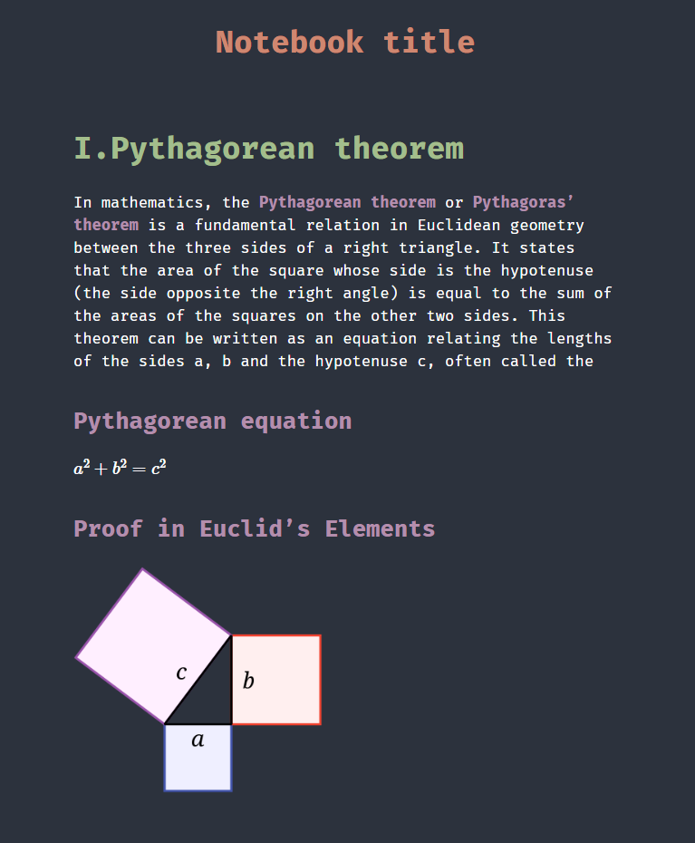

# 📝 Markdown Notebook Template

Notebook template made in markdown and exported to HTML via Pandoc. It also uses **MathJax**, so you can write your math formula's in it.

## 📦 Dependencies

- pandoc ([link to the pandoc's website](https://pandoc.org/))

## 🖋 Usage

1. Clone repo

        git clone https://github.com/jozwikaleksander/markdown-notebook-template.git

2. Write your notes in **index.md file** and add your images to **img directory**.

3. Convert **index.md to HTML** via command below

        pandoc --metadata title="Notebook title" --mathjax="https://cdn.jsdelivr.net/npm/mathjax@3/es5/tex-mml-chtml.js" -c css/style.css -s index.md -o index.htctrlml
    
    or use **VSCode task** I prepared (<kbd>⌃ Control</kbd> + <kbd>⇧ Shift</kbd> + <kbd>P</kbd> choose **Tasks: Run task** and **Convert to HTML**). You can configure this task in .vscode directory.

4. Repeat **steps 2 and 3** until your done.

## 👤 Credits
Project was made by Aleksander Jóźwik ([@jozwikaleksander](https://github.com/jozwikaleksander)).
